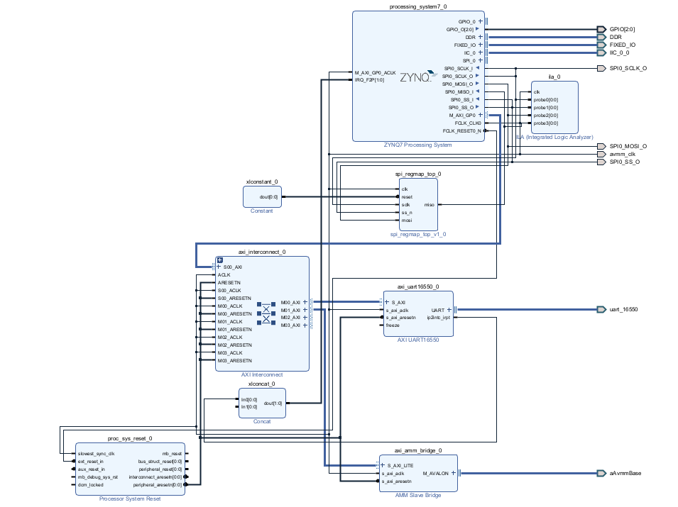
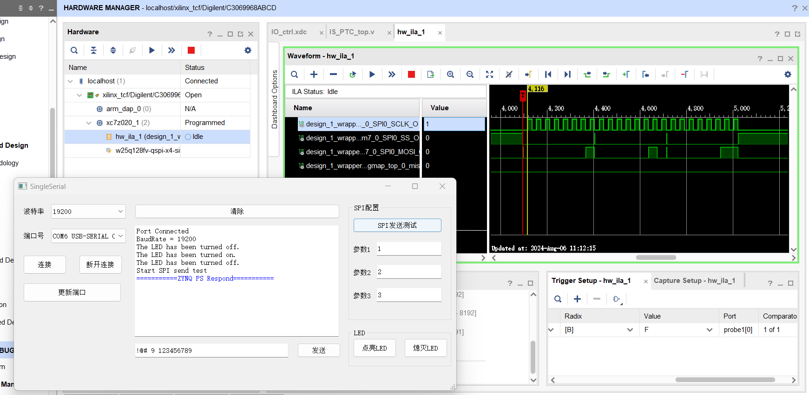
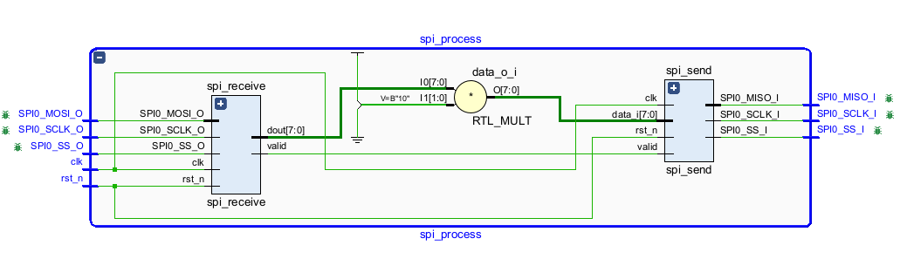
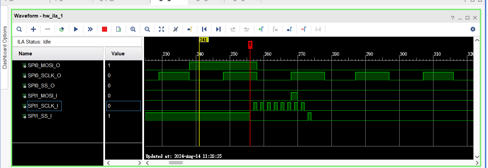
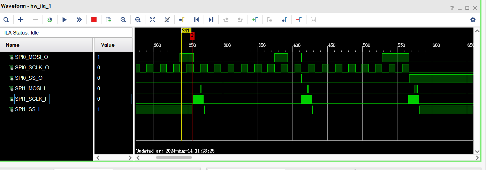

更新版本链接：https://github.com/Starynight410/SPILoopZynq_Demo

利用Uart实现PC与Zynq PS端的数据交互，工程包含两部分：FPGA程序+上位机。

# 开发环境

Vivado/Vitis 2022.2

# 工程列表

SingleSerialPort：Uart控制上位机、prj11_autofocus：ZYNQ系统、PL_SpiProcess：SPI收发及处理模块

# 实现功能

该项目搭建了基于Zynq的Uart数据收发系统，在PS端实现控制LED的亮灭、SPI发送、IIC读写EEPROM，并通过PL端进行结果验证；上位机端实现了串口功能、SPI参数配置、LED控制。此项目可用作原型系统实现PC和PS端更复杂的数据交互。

整体系统如下：

对其中的SPI发送进行测试，上位机配置参数分别为：1、2、3，配置数据SPI发送的ila结果：

# SPI收发模块
为了方便后续的使用，在PL端实现了SPI数据的转发模块，并可完成逻辑运算。PL中实现了SPI数据收发模块，作为slave接收来自ps的SPI数据，完成某项逻辑运算，之后作为master输出。模块如下：

测试中上位机串口发送1、2、3至PS，PS直接转发PL，在PL中ila结果：

